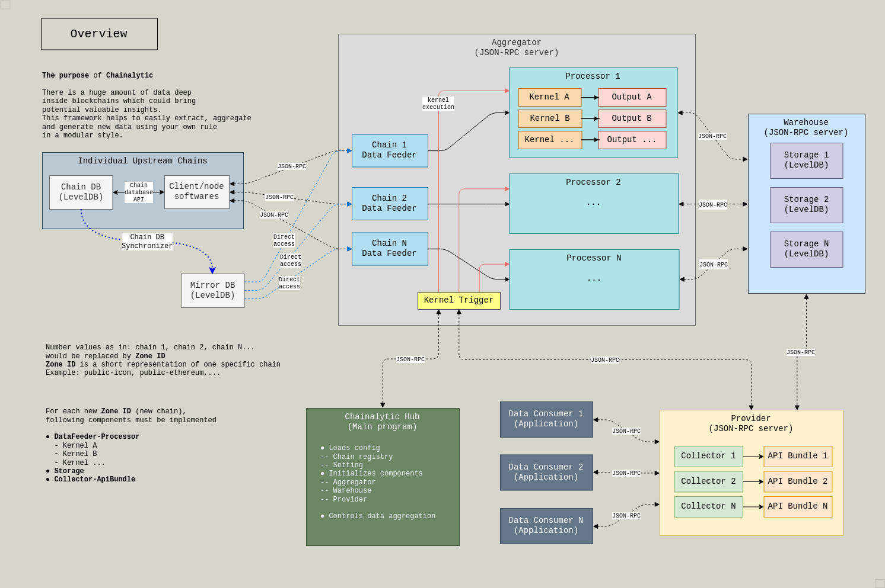
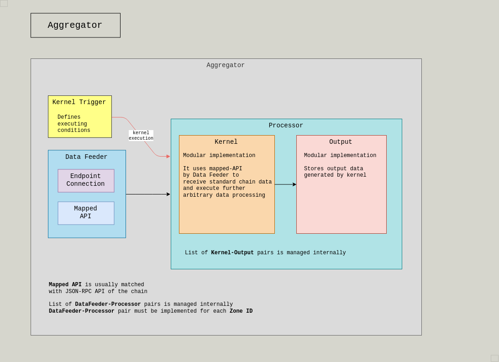
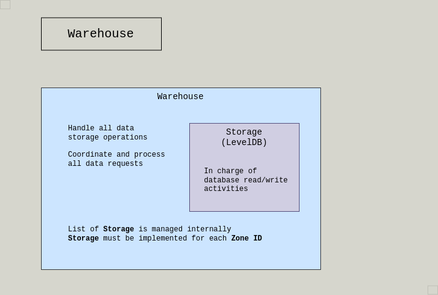
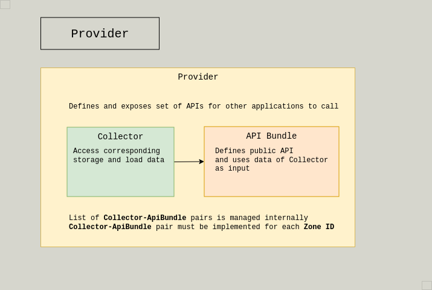

# Chainalytic Framework

## The Purpose

There is a huge amount of data deep
inside blockchains which could bring
potential valuable insights. +
This framework helps to easily extract, aggregate
and generate new data using your own rule
in a modular style.

It comes with one built-in data aggregator for link:https://icon.foundation[ICON] public mainnet.

## Architecture

### Overview

##### Main components

- Chainalytic Hub - this is the entry point ( main process )
- Aggregator
- Warehouse
- Provider

### Details of components

