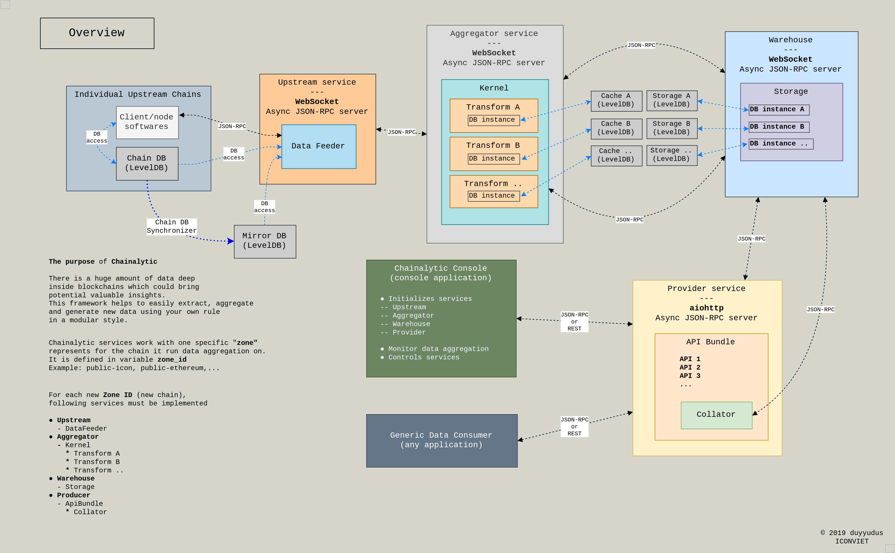

# Chainalytic Framework

Modular framework for blockchain time-series data and arbitrary chain-state derivation/aggregation, which help to generate more insights of generic blockchains.

link:INTRO.adoc[Detailed introduction and the story of Chainalytic]

link:PRODUCTION.adoc[How to use pre-built production Docker image]

link:docs/provider_api.adoc[Jump to Provider service API reference]

## The Purpose

NOTE: _This is *not* the tool that simply extracts block/txs data and dumps to other databases (e.g. SQL, NoSQL, BigQuery ... )_

There is a huge amount of data deep
inside blockchains which could bring
potential valuable insights. +

*This framework focuses on*

- _Derive *implicit* blockchain data using *transactions* as input ( transition functions )_
- _Realtime/offline time-series data derivation/aggregation_
- _Maintain independent and diverse chain-states_

*It helps to easily extract, transform, aggregate
and generate new data using your own rule
in a modular style.*

It targets developers/analysts who are interested in building application or research on

- Blockchain analytic and insights
- Monitoring tools
- Data science, machine learning and AI
- Algo trading

I am also a big fan of link:https://icon.foundation[ICON], thus it comes with one built-in data aggregator for ICON public mainnet.

## Architecture

### Chainalytic services

*_Upstream, service ID = 0_*

Load and pre-processing original block data, then pass it to Aggregator

*_Aggregator, service ID = 1_*

Transform and aggregate data

*_Warehouse, service ID = 2_*

Take care of all storage tasks

*_Provider, service ID = 3_*

Communicate with Warehouse and ask for aggregated data, then provide it to external applications via *aiohttp* JSON-RPC APIs

### Chainalytic Console

Handle data aggregation monitoring.

## Quick start

link:DEVELOPMENT.adoc[Go to development guide here]

*Prerequisite*

Recommend Ubuntu 18.04 and Python 3.7

Install dependencies
[source]
----
sudo apt update
sudo apt install libsecp256k1-dev libleveldb-dev pkg-config build-essential

python37 -m venv venv
venv/bin/pip install -e .
----

### 1. Chainalytic Console

#### 1A. You must setup user config first, run below command to generate it

`venv/bin/python launch.py --init-config`

*Then, in current working dir, there should be 2 config files*

[source]
----
.chainalytic/cfg/chain_registry.yml
.chainalytic/cfg/setting.yml
----

In `chain_registry.yml`, for ICON public chain, modify it like below
----
zones:
  - zone_id: 'public-icon'
    zone_name: 'Public ICON mainnet'
    client_endpoint: 'localhost:9000' # Your citizen node endpoint
    chain_db_dir: 'path_to/data/mainnet/.storage/db_<YOUR_IP>:7100_icon_dex'
    score_db_icondex_dir: 'path_to/data/mainnet/.score_data/db/icon_dex'
    direct_db_access: 0 # Set to 1 for fast aggregation
----

#### 1B. Basic usages

*Run all services*

`venv/bin/python launch.py`

*Monitor one specific data transform*

`venv/bin/python launch.py m <TRANSFORM_ID>`

Default `TRANSFORM_ID` is `stake_history`

List of `TRANSFORM_ID`:
[source]
----
stake_history
stake_top100
recent_stake_wallets
abstention_stake
----

*Terminate all services*

`venv/bin/python launch.py stop`

*Show help*

`venv/bin/python launch.py -h`

### 2. Chainalytic services

*Run individual services ( for debugging )*

[source]
----
venv/bin/python -m chainalytic.upstream --endpoint localhost:5500 --zone_id public-icon --working_dir .
venv/bin/python -m chainalytic.aggregator --endpoint localhost:5510 --zone_id public-icon --working_dir .
venv/bin/python -m chainalytic.warehouse --endpoint localhost:5520 --zone_id public-icon --working_dir .
venv/bin/python -m chainalytic.provider --endpoint localhost:5530 --zone_id public-icon --working_dir .
----
